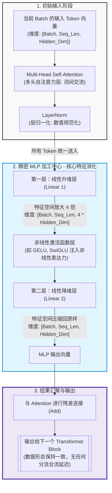

# MLP
Feed-Forward Network/MLP flow

```mermaid
graph TD
    %% 样式定义
    classDef dataStyle fill:#f9f9f9,stroke:#333,stroke-width:2px;
    classDef nnStyle fill:#e1f5fe,stroke:#0288d1,stroke-width:2px;
    classDef logicStyle fill:#fff3e0,stroke:#f57c00,stroke-width:2px;
    classDef outputStyle fill:#ede7f6,stroke:#5e35b1,stroke-width:3px;

    %% 1. 输入阶段
    subgraph Input_Stage [1. 初始输入阶段]
        A["当前 Batch 的输入 Token 向量<br/>(维度: [Batch, Seq_Len, Hidden_Dim])"] --> B["Multi-Head Self-Attention<br/>(多头自注意力层: 词间交流)"]
        B --> C["LayerNorm<br/>(层归一化: 数值规范化)"]
    end
    class Input_Stage dataStyle;

    %% 2. 稠密 MLP 加工中心 (所有 Token 必须 100% 完整流经此地)
    subgraph Dense_MLP_Center [2. 稠密 MLP 加工中心 - 核心特征消化]
        C -->|所有 Token 统一送入| D["第一层：线性升维层 (Linear 1)"]
        D -->|"特征空间放大 4 倍<br/>维度: [Batch, Seq_Len, 4 * Hidden_Dim]"| E["非线性激活函数层<br/>(如 GELU, SwiGLU 注入非线性表达力)"]
        E --> F["第二层：线性降维层 (Linear 2)"]
        F -->|"特征空间压缩回原样<br/>维度: [Batch, Seq_Len, Hidden_Dim]"| G["MLP 输出向量"]
    end
    class Dense_MLP_Center nnStyle;

    %% 3. 结果汇聚与输出
    subgraph Output_Stage [3. 结果汇聚与输出]
        G --> H["与 Attention 进行残差连接 (Add)"]
        H --> I[["输出给下一个 Transformer Block<br/>(数据形态保持一致，无任何分流合流延迟)"]]
    end
    class Output_Stage outputStyle;
```
