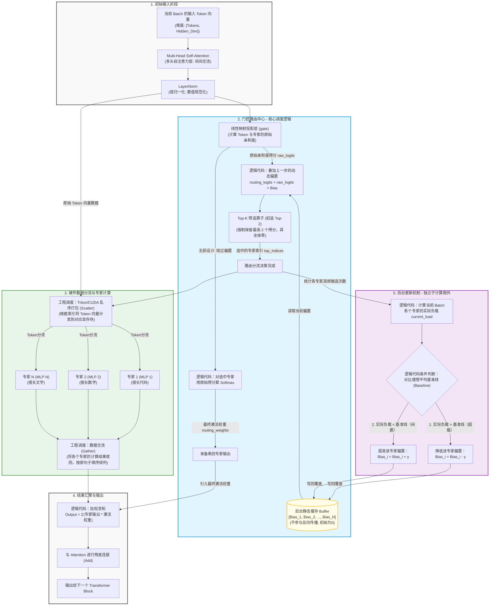

# MoE with Auxiliary-loss-free Routing

```mermaid
graph TD
    %% 样式定义
    classDef dataStyle fill:#f9f9f9,stroke:#333,stroke-width:2px;
    classDef nnStyle fill:#e1f5fe,stroke:#0288d1,stroke-width:2px;
    classDef logicStyle fill:#fff3e0,stroke:#f57c00,stroke-width:2px;
    classDef expertStyle fill:#e8f5e9,stroke:#388e3c,stroke-width:2px;
    classDef controlStyle fill:#f3e5f5,stroke:#8e24aa,stroke-width:2px;

    %% 1. 输入阶段
    subgraph Input_Stage [1. 初始输入阶段]
        A["当前 Batch 的输入 Token 向量<br/>(维度: [Tokens, Hidden_Dim])"] --> B["Multi-Head Self-Attention<br/>(多头自注意力层: 词间交流)"]
        B --> C["LayerNorm<br/>(层归一化: 数值规范化)"]
    end
    class Input_Stage dataStyle;

    %% 2. 路由控制中心
    subgraph Router_Center [2. 门控路由中心 - 核心调度逻辑]
        C --> D["线性映射投影层 (gate)<br/>(计算 Token 与专家的原始亲和度)"]
        D -->|原始亲和度得分 raw_logits| E["逻辑代码：叠加上一步的动态偏置<br/>routing_logits = raw_logits + Bias"]
        
        %% 静态缓存引入
        BiasBuffer[("后台静态缓存 Buffer<br/>[Bias_1, Bias_2, ..., Bias_N]<br/>(不参与反向传播, 初始为0)")] -->|读取当前偏置| E
        
        E --> F["Top-K 筛选算子 (如选 Top-2)<br/>(强制保留最高 2 个得分，其余抹零)"]
        F -->|选中的专家索引 top_indices| G["路由分流决策完成"]
        
        %% 无损权重计算
        D -->|无损设计: 绕过偏置| H["逻辑代码：对选中专家<br/>用原始得分算 Softmax"]
        H -->|最终激活权重 routing_weights| I["准备乘回专家输出"]
    end
    class Router_Center nnStyle;

    %% 3. 数据搬运与专家计算
    subgraph Expert_Processing [3. 硬件数据分流与专家计算]
        G --> J["工程调度：Triton/CUDA 乱序打包 (Scatter)<br/>(根据索引将 Token 向量分发到对应显存块)"]
        C -->|原始 Token 向量数据| J
        
        J -->|Token分流| Exp1["专家 1 (MLP 1)<br/>(擅长代码)"]
        J -->|Token分流| Exp2["专家 2 (MLP 2)<br/>(擅长数学)"]
        J -->|Token分流| ExpN["专家 N (MLP N)<br/>(擅长文学)"]
        
        %% 修正后的单节点独立连接，防止语法不兼容
        Exp1 --> K["工程调度：数据合流 (Gather)<br/>(将各个专家的计算结果收回，按原句子顺序排列)"]
        Exp2 --> K
        ExpN --> K
    end
    class Expert_Processing expertStyle;

    %% 4. 输出加权
    subgraph Output_Stage [4. 结果汇聚与输出]
        K --> L["逻辑代码：加权求和<br/>Output = Σ(专家输出 * 激活权重)"]
        I -->|引入最终激活权重| L
        L --> M["与 Attention 进行残差连接 (Add)"]
        M --> N["输出给下一个 Transformer Block"]
    end
    class Output_Stage dataStyle;

    %% 5. 后台自动化调节逻辑
    subgraph Bias_Updater [5. 后台更新机制 - 独立于计算图外]
        G -->|统计各专家高频被选次数| O["逻辑代码：计算当前 Batch<br/>各个专家的实际负载 current_load"]
        
        O --> P{"逻辑代码条件判断：<br/>对比理想平均基准线 (Baseline)"}
        
        P -->|1. 实际负载 > 基准线（超载）| Q["降低该专家偏置：<br/>Bias_i = Bias_i - γ"]
        P -->|2. 实际负载 < 基准线（闲置）| R["提高该专家偏置：<br/>Bias_i = Bias_i + γ"]
        
        Q -->|写回覆盖| BiasBuffer
        R -->|写回覆盖| BiasBuffer
    end
    class Bias_Updater controlStyle;

    %% 连线微调
    style BiasBuffer fill:#fffde7,stroke:#fbc02d,stroke-width:2px;
```
