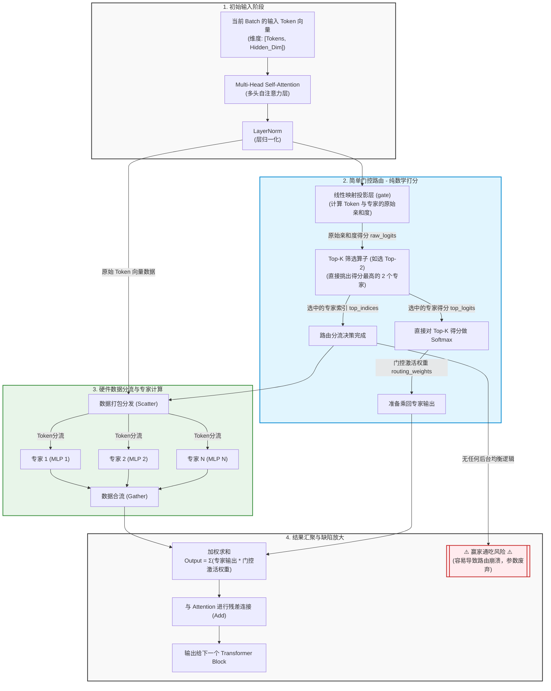

# Dense Gated MoE

```mermaid
graph TD
    %% 样式定义
    classDef dataStyle fill:#f9f9f9,stroke:#333,stroke-width:2px;
    classDef nnStyle fill:#e1f5fe,stroke:#0288d1,stroke-width:2px;
    classDef expertStyle fill:#e8f5e9,stroke:#388e3c,stroke-width:2px;
    classDef warningStyle fill:#ffebee,stroke:#c62828,stroke-width:2px;

    %% 1. 输入阶段
    subgraph Input_Stage [1. 初始输入阶段]
        A["当前 Batch 的输入 Token 向量<br/>(维度: [Tokens, Hidden_Dim])"] --> B["Multi-Head Self-Attention<br/>(多头自注意力层)"]
        B --> C["LayerNorm<br/>(层归一化)"]
    end
    class Input_Stage dataStyle;

    %% 2. 简单路由机制
    subgraph Simple_Router [2. 简单门控路由 - 纯数学打分]
        C --> D["线性映射投影层 (gate)<br/>(计算 Token 与专家的原始亲和度)"]
        D -->|原始亲和度得分 raw_logits| E["Top-K 筛选算子 (如选 Top-2)<br/>(直接挑出得分最高的 2 个专家)"]
        
        E -->|选中的专家索引 top_indices| F["路由分流决策完成"]
        E -->|选中的专家得分 top_logits| G["直接对 Top-K 得分做 Softmax"]
        G -->|门控激活权重 routing_weights| H["准备乘回专家输出"]
    end
    class Simple_Router nnStyle;

    %% 3. 数据搬运与专家计算
    subgraph Expert_Processing [3. 硬件数据分流与专家计算]
        F --> I["数据打包分发 (Scatter)"]
        C -->|原始 Token 向量数据| I
        
        I -->|Token分流| Exp1["专家 1 (MLP 1)"]
        I -->|Token分流| Exp2["专家 2 (MLP 2)"]
        I -->|Token分流| ExpN["专家 N (MLP N)"]
        
        Exp1 --> J["数据合流 (Gather)"]
        Exp2 --> J
        ExpN --> J
    end
    class Expert_Processing expertStyle;

    %% 4. 输出加权与致命缺陷
    subgraph Output_Stage [4. 结果汇聚与缺陷放大]
        J --> K["加权求和<br/>Output = Σ(专家输出 * 门控激活权重)"]
        H --> K
        K --> L["与 Attention 进行残差连接 (Add)"]
        L --> M["输出给下一个 Transformer Block"]
        
        %% 缺陷连线
        F -->|无任何后台均衡逻辑| Bug[["⚠️ 赢家通吃风险 ⚠️<br/>(容易导致路由崩溃，参数废弃)"]]
    end
    class Output_Stage dataStyle;
    style Bug fill:#ffebee,stroke:#c62828,stroke-width:2px;
```
