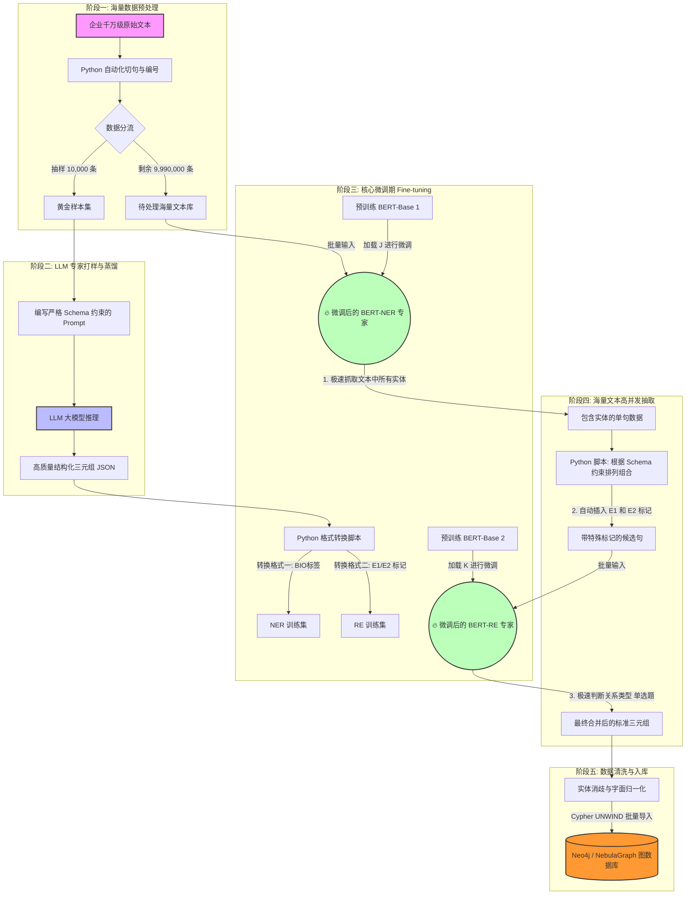

# Creating Huge Knowledge Graph

Typical steps for creating huge knowledge graph for large
amount of data.

```mermaid
graph TD
    %% 样式定义
    classDef source fill:#f9f,stroke:#333,stroke-width:2px;
    classDef llm fill:#bbf,stroke:#333,stroke-width:2px;
    classDef tune fill:#fbb,stroke:#333,stroke-width:2px;
    classDef bert fill:#bfb,stroke:#333,stroke-width:2px;
    classDef db fill:#f93,stroke:#333,stroke-width:2px;

    %% 阶段一：数据预处理
    subgraph 阶段一: 海量数据预处理
        A[企业千万级原始文本] --> B[Python 自动化切句与编号]
        B --> C{数据分流}
        C -->|抽样 10,000 条| D[黄金样本集]
        C -->|剩余 9,990,000 条| E[待处理海量文本库]
    end
    class A source;

    %% 阶段二：LLM 弱监督标注
    subgraph 阶段二: LLM 专家打样与蒸馏
        D --> F[编写严格 Schema 约束的 Prompt]
        F --> G[LLM 大模型推理]
        G --> H[高质量结构化三元组 JSON]
    end
    class G llm;

    %% 阶段三：数据转换与模型微调
    subgraph 阶段三: 核心微调期 Fine-tuning
        H --> I[Python 格式转换脚本]
        I -->|转换格式一: BIO标签| J[NER 训练集]
        I -->|转换格式二: E1/E2 标记| K[RE 训练集]
        
        L[预训练 BERT-Base 1] -->|加载 J 进行微调| M((🔥 微调后的 BERT-NER 专家))
        N[预训练 BERT-Base 2] -->|加载 K 进行微调| O((🔥 微调后的 BERT-RE 专家))
    end
    class M,O tune;

    %% 阶段四：海量文本规模化量产
    subgraph 阶段四: 海量文本高并发抽取
        E -->|批量输入| M
        M -->|1. 极速抓取文本中所有实体| P[包含实体的单句数据]
        P --> Q[Python 脚本: 根据 Schema 约束排列组合]
        Q -->|2. 自动插入 E1 和 E2 标记| R[带特殊标记的候选句]
        R -->|批量输入| O
        O -->|3. 极速判断关系类型 单选题| S[最终合并后的标准三元组]
    end
    class M,O bert;

    %% 阶段五：知识融合与入库
    subgraph 阶段五: 数据清洗与入库
        S --> T[实体消歧与字面归一化]
        T -->|Cypher UNWIND 批量导入| U[(Neo4j / NebulaGraph 图数据库)]
    end
    class U db;
```
