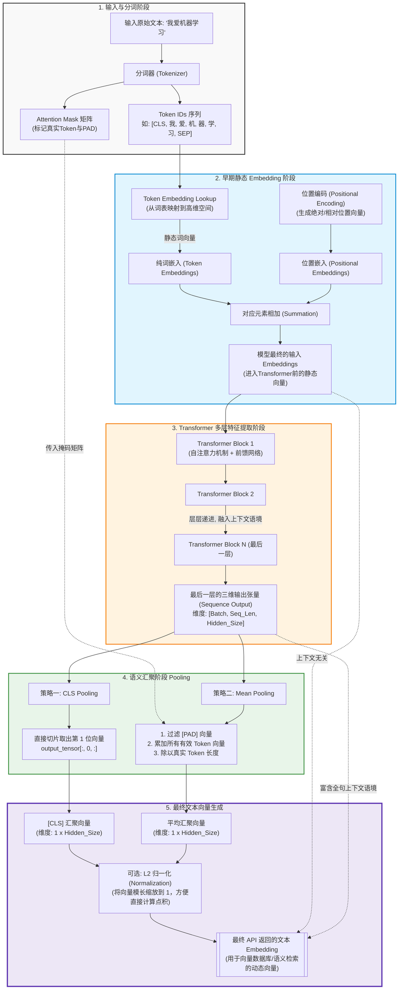

# Text Embeddings

This figure shows methods that text embeddings are generated by. 

```mermaid
graph TD
    %% 阶段样式定义
    classDef inputStyle fill:#f9f9f9,stroke:#333,stroke-width:2px;
    classDef layerStyle fill:#e1f5fe,stroke:#0288d1,stroke-width:2px;
    classDef attentionStyle fill:#fff3e0,stroke:#f57c00,stroke-width:2px;
    classDef poolStyle fill:#e8f5e9,stroke:#388e3c,stroke-width:2px;
    classDef outputStyle fill:#ede7f6,stroke:#5e35b1,stroke-width:3px;

    %% 1. 输入数据准备
    subgraph Input_Stage [1. 输入与分词阶段]
        A["输入原始文本: '我爱机器学习'"] --> B["分词器 (Tokenizer)"]
        B --> C["Token IDs 序列<br/>如: [CLS, 我, 爱, 机, 器, 学, 习, SEP]"]
        B --> AM["Attention Mask 矩阵<br/>(标记真实Token与PAD)"]
    end
    class Input_Stage inputStyle;

    %% 2. 早期静态嵌入
    subgraph Early_Embedding [2. 早期静态 Embedding 阶段]
        C --> D["Token Embedding Lookup<br/>(从词表映射到高维空间)"]
        D -->|静态词向量| E["纯词嵌入 (Token Embeddings)"]
        
        F["位置编码 (Positional Encoding)<br/>(生成绝对/相对位置向量)"] --> G["位置嵌入 (Positional Embeddings)"]
        
        E & G --> H["对应元素相加 (Summation)"]
        H --> I["模型最终的输入 Embeddings<br/>(进入Transformer前的静态向量)"]
    end
    class Early_Embedding layerStyle;

    %% 3. Transformer 主体堆叠
    subgraph Transformer_Blocks [3. Transformer 多层特征提取阶段]
        I --> Block1["Transformer Block 1<br/>(自注意力机制 + 前馈网络)"]
        Block1 --> Block2["Transformer Block 2"]
        Block2 -->|层层递进, 融入上下文语境| BlockN["Transformer Block N (最后一层)"]
        
        BlockN --> J["最后一层的三维输出张量 (Sequence Output)<br/>维度: [Batch, Seq_Len, Hidden_Size]"]
    end
    class Transformer_Blocks attentionStyle;

    %% 4. 池化与压缩
    subgraph Pooling_Strategies [4. 语义汇聚阶段 Pooling]
        J --> K1["策略一: CLS Pooling"]
        J --> K2["策略二: Mean Pooling"]
        
        K1 --> L1["直接切片取出第 1 位向量<br/>output_tensor[:, 0, :]"]
        
        AM -.->|传入掩码矩阵| L2
        K2 --> L2["1. 过滤 [PAD] 向量<br/>2. 累加所有有效 Token 向量<br/>3. 除以真实 Token 长度"]
    end
    class Pooling_Strategies poolStyle;

    %% 5. 最终产出
    subgraph Final_Output [5. 最终文本向量生成]
        L1 --> M1["[CLS] 汇聚向量<br/>(维度: 1 x Hidden_Size)"]
        L2 --> M2["平均汇聚向量<br/>(维度: 1 x Hidden_Size)"]
        
        M1 & M2 --> N["可选: L2 归一化 (Normalization)<br/>(将向量模长缩放到 1，方便直接计算点积)"]
        N --> O[["最终 API 返回的文本 Embedding<br/>(用于向量数据库/语义检索的动态向量)"]]
    end
    class Final_Output outputStyle;

    %% 核心节点连线强调
    I -.->|上下文无关| O
    J -.->|富含全句上下文语境| O
```
